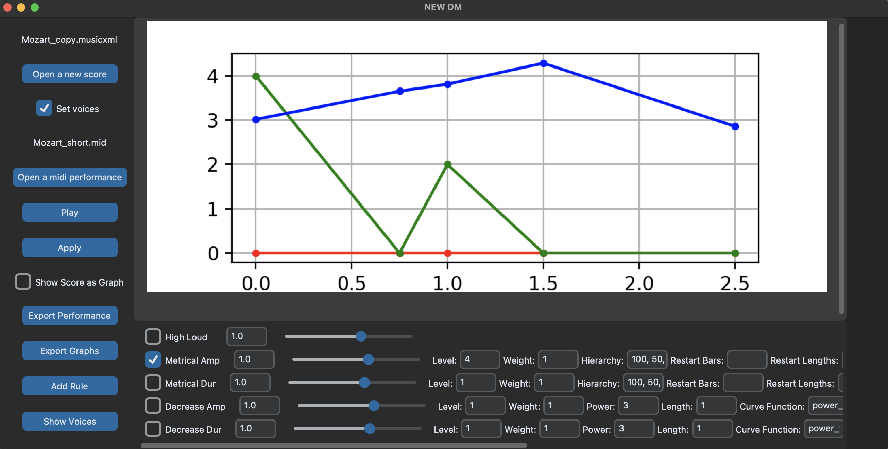

# Director Musices Novus
This tool is a new version of **Director Musices** created as part of my master thesis. 

For more information on the original **Director Musices** follow these links:
- add link to dm github
- add link to dm github site
- add referenze to papers

## Installation

To use the tool, first clone this repository or download the files. Optionally create a virtual environment for Python using this command:
```
python -m venv /path/to/new/virtual/environment
```

Active the environment:
```
source /yourenvironment/bin/activate
```

Install the required packages:
```
pip install -r requirements.txt
```

To start the tool, run the **main.py** file.

## Usage



### Buttons
- **Open a new score:** user can choose a new score (file formats: mei, musicxml, midi, humdrum **kern)
- **Set voices:** if selected, the voice estimation algorithm estimates the voices and assigns them to the notes (useful if score has no voice markings)
- **Open a midi performance:** user can choose a performance in midi format. The piece and the section/part should match the currently opened score!
- **Play:** playback of the rule generated performance
- **Apply:** applying all selected rules with the respective parameters to generate a performance
- **Show score as Graph:** if selected while pressing apply, a graph showing every voice as a line will be displayed (y-axis = midi-pitch, x-axis = time in quarternotes)
- **Export Performance:** exports the rule generated performance as midi file (named "rulegenerated_performance.mid")
- **Export Graphs:** exports all graphs and the piano roll as png files
- **Add Rule:** opens an input dialog for the user to choose a rule to open. All available rules can be found in the dictionary in **rule_dictionary.py**
- **Show Voices:** opens a window with checkboxes. The user can select which attribute (volume, duration, duration difference) of every voice will be opened as a graph

### Rules
- Every rule starts with a checkbox. When pressing apply, all selected rules will be applied.
- Following the name of the rule, there is a number box and a slider. These control the quantity parameter for the rule. The user can adjust how big the effect of the rule should be.
- Following are all parameters individual to the rule. Each parameter is labeled by name and has one input box for the value.

## Adding new rules

New rules can be defined and used. For creating a new rule, add a new Python-file in the **rules** folder and copy the content of the **blue_print.py** file into it. As the name suggests, this file serves as a blue print for new rules. Also have a look at the other rules for implementation ideas. 

### Basic file structure of rules

The **blue_print.py** file shows the basic structure every rule should follow:

Line 4: Initialization function to create a new instance of the rule. Initialization is placed in a function so it can be called through a dictionary.

Line 7: The rule as a separate class. Class name should be the rule name and it should be inherit from the **Rule** class. The **__init__** function takes 3 arguments for placing the parameter inputs in the GUI.

Line 11: Add the rule name to be displayed in the GUI here.

Line 14: the variable **upcountingColumn** serves to place the parameter input objects in the right column of the GUI. It starts on 3, because column 0, 1 and 2 are used by the parent class. After adding a parameter input, increment this variable by 2 (see line 17).

Line 16: Here you can add all the parameter inputs needed for your rule. The available classes are **IntInput**, **DoubleInput**, **StringInput** and **BooleanInput**. Choose the class based on the value type of your parameter. The classes take 4 arguments, the first 2 are fix. 3. argument is the default value and 4. argument is the name of the parameter.

Line 19: Every rule needs to implement the **apply** method. It is the staring point of execution and is called when pressing **Apply** in the GUI. Here you can add the functionality of your rule.

### Manipulating the notes

The notes and their properties are accessed through the **scoreAndPerformance** variable. It should be imported like so:

```python
from scoreAndPerformance import scoreAndPerformance
```

It has the basic partitura classes score and performance as properties. 

To iterate through every note and rest of a voice, you can use the following:

```python
for voice in scoreAndPerformance.getVoices():
    notesAndRests = scoreAndPerformance.getNotesAndRestsOfVoice(voice)
    
    for idx, noteRest in enumerate(notesAndRests):
        if checkConditions(lambda : not is_last_note(idx, notesAndRests)):
```

Use **checkConditions** or just normal if-Statements to only iterate through specific notes.

Change properties of the notes with the functions **set_attribute()**, **add_attribute()**. For duration use: **set_duration()**, **add_duration()** and for dynamic use: **set_attribute()**, **add_attribute()** with the attribute called "sound_level".